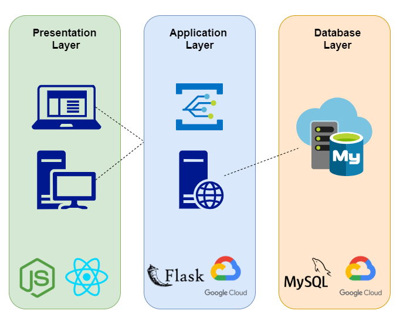

## Project LAMAS

# System Design

CSC301: Intro to Software Engineering 

Lazar, Ahmad, Michelle, Alfonso, Shahmeer

&nbsp;

&nbsp;

## Table of Contents

- [CRC Cards](#crc)
- [Software Architecture Diagram](#Architecture)

## CRC

### _React Components_

Class Name | App
------------ | -------------
Parent class | React.Component
Classname subclasses | Everything below this
Responsibilities | Provides all the routing for the website. Stores state for session id and user type for login purposes. Renders all components based on the route, and redirects to login page if session id expires. 
Collaborators | Alfonso, Michelle
-------------------------

Class Name | Button
------------ | -------------
Parent class | React.Component
Classname subclasses | N/A
Responsibilities | Renders itself based on props and css classnames. This is a functional component, so it has no state. This component can be a subclass of any other component.
Collaborators | Michelle
-------------------------

Class Name | NavBar
------------ | -------------
Parent class | React.Component
Classname subclasses | (React-router-dom) Link, Button, SearchBar
Responsibilities | Provides a way to navigate throughout the website. Uses react-router-dom Links with buttons, so they canl redirect users to a new page. 
Collaborators | Michelle
-------------------------

Class Name | SearchBar
------------ | -------------
Parent class | React.Component
Classname subclasses | (React-router-dom) Link, Button, SearchBar
Responsibilities | Resets the search bar on redirection to a new page. Sends search queries to the backend, and redirects to search results.
Collaborators | Michelle
-------------------------

Class Name | StudentRegistration
------------ | -------------
Parent class | React.Component
Classname subclasses | (Material-UI) TextField, MenuItem (React-router-dom) Redirect
Responsibilities | Displays a student registration form. The component is able to validate form entries such as email and password. The state stores all user input and sends a POST request on submit. The component will handle redirection to a new page on success. 
Collaborators | Michelle
-------------------------

Class Name | HomePage
------------ | -------------
Parent class | React.Component
Classname subclasses | (Material-UI) Grid, (React-router-dom) Link, Button
Responsibilities | Displays the LawHub homepage when no user is logged on. This includes the slogan and information about the web application. The component contains buttons for student and recruiter registration.
Collaborators | Michelle
-------------------------

Class Name | Login
------------ | -------------
Parent class | React.Component
Classname subclasses | (Material-UI) TextField, MenuItem, (React-router-dom) Redirect
Responsibilities | Displays a login page for both students and recruiters. This page validates its form entries for email and password.. The state stores user input and sends a POST request, which will redirect the user to a successful login page or tell them their credentials could not be verified based on the server response.
Collaborators | Alfonso
-------------------------

Class Name | Mock
------------ | -------------
Parent class | React.Component
Classname subclasses | (Material-UI) Grid, (React-router-dom) Link, Button
Responsibilities | Temporary component to display mock quizzes. A button for creating a quiz will appear if the logged in user is a recruiter. 
Collaborators | Michelle
-------------------------

Class Name | Requests
------------ | -------------
Parent class | React.Component
Classname subclasses | N/A
Responsibilities | Handles fetch requests to the backend. All functions run asynchronously. Also stores a variable for the ip address, if it needs to change.
Collaborators | Michelle
-------------------------

Class Name | Auth
------------ | -------------
Parent class | React.Component
Classname subclasses | (js-cookies) Cookies
Responsibilities | Handles authentication for a user. Adds sessId as a cookie to the browser. Sends requests to backend to verify that a user’s token has not expired.
Collaborators | Michelle
-------------------------

Class Name | Answer
------------ | -------------
Parent class | React.Component
Classname subclasses | (Material-UI) Grid, Radio
Responsibilities | Create a button corresponding to a possible answer for a multiple choice question in the quiz completion UI.
Collaborators | Alfonso
-------------------------

Class Name | AnswerList
------------ | -------------
Parent class | React.Component
Classname subclasses | (Material-UI) Grid
Responsibilities | Create a grid for all the possible answers for a multiple choice question in the quiz completion UI.
Collaborators | Alfonso
-------------------------

Class Name | Question
------------ | -------------
Parent class | React.Component
Classname subclasses | (Material-UI) Grid
Responsibilities | Display the question in different text for a multiple question in the quiz completion UI.
Collaborators | Alfonso
-------------------------

Class Name | QuizArea
------------ | -------------
Parent class | React.Component
Classname subclasses | (Material-UI) LinearProgress, Grid, TextField, (React-Compound-Timer) Timer
Responsibilities | Create the display for each question in the quiz completion UI. Include a timer, progress bar, and a “Next” button to proceed to the next question after a student has selected their answer to a multiple choice question (so it doesn’t automatically proceed after they click an answer by accident).
Collaborators | Alfonso, Michelle
-------------------------

Class Name | TakeQuiz
------------ | -------------
Parent class | React.Component
Classname subclasses |
Responsibilities | Create the page that will handle quiz completion for student users. Handle HTTP requests with the backend for quiz retrieval, quiz result submission, handling errors and handling click events.
Collaborators | Alfonso
-------------------------

Class Name | EditProfile
------------ | -------------
Parent class | React.Component
Classname subclasses | (Material-UI) TextField, MenuItem
Responsibilities | Create the page for student profile customization. Includes buttons for profile picture and resume file uploading (not functional yet, just placeholders). Also include drop-down menus for indicating their post-secondary institution, level of study, and a text field for a biography.
Collaborators | Alfonso
-------------------------

Class Name | RecruiterProfile
------------ | -------------
Parent class | React.Component
Classname subclasses | (Material-UI) TextField
Responsibilities | Create the page for recruiter profile customization. Includes a button for profile picture file uploading (not functional yet, just a placeholder). Also include text fields for the company name, title, and a biography.
Collaborators | Alfonso
-------------------------

Class Name | Profile
------------ | -------------
Parent class | React.Component
Classname subclasses | Button, ProfileStats
Responsibilities | Displays a student user's information. This includes their biography, school, study level, country and state. Also displays graphs based on user quiz history.
Collaborators | Michelle
-------------------------

Class Name | ProfileStats
------------ | -------------
Parent class | React.Component
Classname subclasses | OverallStats, History, CategoryStats
Responsibilities | The component that functions as a tab window to switch between different stats to display. This includes the overall statistics, quiz history and category breakdown. 
Collaborators | Michelle
-------------------------

Class Name | Leaderboard
------------ | -------------
Parent class | React.Component
Classname subclasses | (Recharts) Bar, BarGraph, LeaderboardChart
Responsibilities | The overall leaderboard across all users. Users are ranked by their average score. Displays an animated leaderboard visual with the top 3 users and a chart consisting of the top users with their total quizzes done and average scores.
Collaborators | Michelle
-------------------------

Class Name | QuizLeaderboard
------------ | -------------
Parent class | React.Component
Classname subclasses | LeaderboardChart
Responsibilities | The leaderboard for a specific quiz. Users are ranked by highest score on the quiz. Columns in the leaderboard chart include the user's name, date of completion and quiz score.
Collaborators | Michelle
-------------------------

Class Name | StudentFilter
------------ | -------------
Parent class | React.Component
Classname subclasses | (Material-UI) TextField, MenuItem
Responsibilities | Create the page for filtering students to be searched for. Includes drop-down options for their post-secondary institution, level of study, country, state/province and a text box for their city. Displays all relevant students matching the filter criteria in a table with the user ID and student name.
Collaborators | Alfonso
-------------------------

Class Name | QuizFilter
------------ | -------------
Parent class | React.Component
Classname subclasses | (Material-UI) TextField
Responsibilities | Create the page for filtering quizzes that can be completed. Includes text fields to filter by quiz name, quiz author, or 3 different tags. Displays all relevant quizzes matching the filter criteria in a table with the quiz id, quiz name, and number of questions in the quiz.
Collaborators | Alfonso
-------------------------

Class Name | QuizCreation
------------ | -------------
Parent class | React.Component
Classname subclasses | (Material-UI) TextField, Radio, FormControl, FormLabel, RadioGroup, FormControlLabel, (React-router-dom) Redirect, Button
Responsibilities | Creates the quiz creation form. This includes text fields for the quiz title, tags, questions, correct answers and wrong answers. A quiz needs at least 3 questions and the fields will be rendered as the user changes the number of questions. Error checking ensures that no field is left blank. 

For using pre-made quiz questions, it fetches all existing quiz questions in the database for the quiz creator to use if they desire. Also updates the display for each question to have the text boxes if the user would like to create their own question, or provides a list of questions (and their one correct  solution) to choose from.

Collaborators | Michelle, Alfonso
-------------------------

### _Back-end Components_

Class Name | Login
------------ | -------------
Parent class | Resource (abstract RESTful resource)
Classname subclasses | N/A
Responsibilities | Handles POST login requests for both student and recruiter accounts. Parses the request which must consist of an email and password. It then will query the database and fulfil necessary checks. Upon success, it returns the uid of the user and a generated sessionid which will be used to authenticate the user throughout their session.
Collaborators | Ahmad
-------------------------

Class Name | Register
------------ | -------------
Parent class | Resource (abstract RESTful resource)
Classname subclasses | RegisterStudent, RegisterRecruiter
Responsibilities | Receives a POST register request and parses the necessary arguments. It will insert a new row into the AppUser table of the database which consists of all necessary user information such as email, first name, last name, country, state, city, role, and their hashed password.
Collaborators | Shahmeer
-------------------------

Class Name | RegisterStudent
------------ | -------------
Parent class | Register
Classname subclasses | N/A
Responsibilities | Passes the POST request to the Register class along with the role “student” to the Register class to indicate a student account to be created.
Collaborators | Shahmeer
-------------------------

Class Name | RegisterRecruiter
------------ | -------------
Parent class | Register
Classname subclasses | N/A
Responsibilities | Passes the POST request to the Register class along with the role “recruiter” to the Register class to indicate a student account to be created.
Collaborators | Shahmeer
-------------------------

Class Name | EditProfile
------------ | -------------
Parent class | Resource (abstract RESTful resource)
Classname subclasses | EditProfileStudent, EditProfileRecruiter
Responsibilities | Receives a POST request to update a row in the specified role table. It will receive a role of either student or recruiter, then updates the necessary columns with the given arguments.
Collaborators | Ahmad
-------------------------

Class Name | EditProfileStudent
------------ | -------------
Parent class | Resource (abstract RESTful resource)
Classname subclasses | EditProfileStudent, EditProfileRecruiter
Responsibilities | Passes the POST request to parent class EditProfile with the role as Student and the necessary fields that must be updated in the Student table.
Collaborators | Ahmad
-------------------------

Class Name | addQuiz
------------ | -------------
Parent class | Resource (abstract RESTful resource)
Classname subclasses | -
Responsibilities | Parses the POST request for adding a quiz. It parses the title, author, tags, number of questions, and questions then executes the necessary queries to add the quiz and the questions into the database. 
Collaborators | Ahmad
-------------------------

Class Name | SubmitQuiz
------------ | -------------
Parent class | Resource (abstract RESTful resource)
Classname subclasses | -
Responsibilities | Receives a POST register request and parses the necessary arguments. It will calculate the score of the quiz that was submitted based on the number of correct multiple choice questions. It will then create a QuizRecord in the MySQL database, which signifies an attempt at some quiz by some user.
Collaborators | Shahmeer
-------------------------

Class Name | VerifyUser
------------ | -------------
Parent class | Resource (abstract RESTful resource)
Classname subclasses | -
Responsibilities | Receives a POST register request and parses the necessary arguments. It will check a local database which has user IDs, tokens assosciated with a session ID, and the timestamp of the token. The class will check if the supplied user has been authenticated within the last 5 minutes, ie if the local authentication database has a token for that user with a timestamp of within the last 5 minutes, and will return HTTP 200 if it does, or HTTP 401 if it does not/the token is older than 5 minutes. Everytime this happens, the timestamp of tokens are updated.
Collaborators | Shahmeer
-------------------------

## Architecture

### _System Interaction_

Since our system is a website and is being hosted on Google Cloud Platform, it is OS independent and does not require any software to be installed on the device using our system. However, during the application’s development process, we required different programming language compilers, VMs and DBs. For the database layer, we created a mySQL server and coded in a mySQL shell. For the application layer we used Python as the main programming language, Python’s Flask micro-web framework, SQLite for testing and handling logged in user session IDs, and Postman for testing. For the presentation layer, we used React and Node.js to setup our React project.

### _Software Architecture Diagram_

Reference: https://www.linuxjournal.com/article/3508

Our system is split into 3 distinct components, the Presentation Layer (front-end), the Application Layer (back-end), and the Database Layer. The front-end communicates with the back-end by hitting an endpoint. The back-end then communicates with the database to store or fetch data and responds to the front-end.

__Presentation Layer__

The role of the Presentation Layer is to provide the users with a visually appealing, easy to use GUI to use our system. There will be several pages such as the home page, registration, login, quiz creation/completion and more, all of which will communicate with the application layer to achieve desired functionality. It will send HTTP requests to the application layer for actions such as registering in order to save a new user’s profile info in our database, or to validate a user’s credentials for logging in, or retrieving information about a certain user when loading their profile. Based on the response received from the application layer, the presentation layer will redirect the user to other pages in our system or display the desired information.

__Application Layer__

The role of the Application Layer is to act as the middleman between the presentation and database layer via endpoints. The Application Layer receives requests from the Presentation Layer which is then parsed and carried out by interacting with the Database Layer. For example, to log a user in, the Presentation Layer will send a request to the login endpoint of the Application Layer. The request will be parsed and the necessary queries will be sent to the Database Layer for execution. The Application Layer will then make necessary checks and send a response to the Presentation Layer indicating the success of the log in. The Application Layer will be responsible for handling errors such as inconsistencies in requests. For example, incorrectly formatted JSON bodies, incorrect login information, and invalid session IDs. The Application Layer will communicate these errors with the Presentation Layer using various HTTP response codes to indicate what error had occurred.

__Database Layer__

The role of the database is to store all the necessary information and records for users and quizzes. It has tables for users, student information, recruiter information, quizzes, postings, etc. The back-end will send queries to the database which will in-turn return the necessary records for the query. The database will also receive insert statements to insert new data into the tables. The tables in the database have constraints on attributes and relationships. For example, when inserting into the AppUser table, the email must be unique. If a duplicate email exists, the insert will be rejected and a message will be sent to the back-end.
